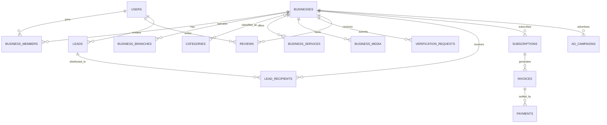

# YellowPages.so Complete Database Architecture

**Database:** PostgreSQL 16+  
**Architecture:** Modular monolith, normalized relational core, event-driven integrations  
**Primary goals:** business discovery, verification, lead generation, reviews, subscriptions, advertising, payments, analytics, moderation, CMS, and future marketplace expansion.

---

## 1. Design principles

1. PostgreSQL is the system of record.
2. UUID primary keys are used for externally exposed records.
3. Human-readable reference numbers are stored separately.
4. Business ownership and staff access are modeled independently.
5. Verification is evidence-based and auditable.
6. Search data is denormalized into Meilisearch, but PostgreSQL remains authoritative.
7. Financial records are append-only wherever practical.
8. Soft deletion is used for recoverable business content; payments and audit logs are never hard-deleted.
9. Every important table includes `created_at` and `updated_at`.
10. High-volume event tables are partition-ready.

---

## 2. Database schemas

Use PostgreSQL schemas to separate concerns:

- `iam` — identity, authentication, roles, permissions
- `directory` — businesses, branches, categories, services, products, locations
- `verification` — claims, verification requests, checks, evidence
- `reviews` — reviews, replies, votes, reports
- `leads` — quote requests, assignments, messages, status history
- `billing` — plans, subscriptions, invoices, payments, refunds, wallets
- `advertising` — campaigns, placements, creatives, delivery events
- `notifications` — templates, notifications, delivery attempts
- `analytics` — search events, profile events, daily metrics
- `moderation` — reports, sanctions, fraud signals, blocked entities
- `cms` — pages, articles, FAQs, banners, navigation
- `system` — settings, audit logs, jobs, webhooks, idempotency keys

---

## 3. Core entity relationships

---

## 4. Table inventory

### IAM

- users
- user_profiles
- user_emails
- user_phones
- user_addresses
- roles
- permissions
- role_permissions
- user_roles
- user_sessions
- login_attempts
- password_reset_tokens
- otp_challenges
- user_devices
- user_preferences

### Directory

- businesses
- business_members
- business_claims
- business_branches
- business_contacts
- business_social_links
- business_opening_hours
- business_special_hours
- business_service_areas
- business_payment_methods
- business_media
- business_keywords
- categories
- category_closure
- business_categories
- services
- business_services
- products
- business_products
- countries
- administrative_areas
- cities
- districts
- neighbourhoods
- addresses
- landmarks

### Verification

- verification_levels
- verification_requests
- verification_checks
- verification_documents
- verification_visits
- verification_decisions

### Reviews

- reviews
- review_responses
- review_votes
- review_reports
- review_moderation_actions

### Leads

- leads
- lead_service_items
- lead_recipients
- lead_assignments
- lead_messages
- lead_status_history
- lead_attachments
- lead_feedback

### Billing

- plans
- plan_features
- plan_feature_values
- subscriptions
- subscription_history
- invoices
- invoice_items
- payment_providers
- payments
- refunds
- payment_webhooks
- business_wallets
- wallet_transactions

### Advertising

- ad_placements
- ad_campaigns
- ad_creatives
- ad_target_locations
- ad_target_categories
- ad_daily_budgets
- ad_events

### Notifications

- notification_templates
- notifications
- notification_deliveries
- user_notification_preferences

### Analytics

- search_events
- business_events
- lead_events
- daily_business_metrics
- daily_platform_metrics

### Moderation and security

- reports
- moderation_actions
- sanctions
- fraud_signals
- blocked_entities
- duplicate_candidates

### CMS

- pages
- articles
- article_categories
- article_category_links
- faqs
- banners
- navigation_items

### System

- audit_logs
- system_settings
- webhooks
- webhook_deliveries
- idempotency_keys
- background_jobs
- data_exports

---

## 5. Critical modeling decisions

### Business ownership

A business can have many members. Membership stores role and status.

- `owner`
- `manager`
- `marketing`
- `sales`
- `customer_service`
- `branch_manager`
- `analyst`

The first approved owner should not be removable unless ownership is transferred.

### Location hierarchy

Use generic `administrative_areas` for region/state flexibility, then explicit city, district, and neighbourhood tables for search performance.

### Categories

Use adjacency plus closure table:

- `categories.parent_id`
- `category_closure.ancestor_id`
- `category_closure.descendant_id`
- `category_closure.depth`

This supports unlimited category depth and fast category-tree searches.

### Verification

Verification requests are immutable submissions. Each request has checks, evidence, visits, and a final decision. The business stores only its current verification level.

### Leads

A single customer request may be sent to several businesses through `lead_recipients`. Each recipient has its own pipeline status, allowing one business to win while others lose.

### Reviews

A review belongs to one user and one business. One user may review the same business again only after a configurable cooling period or separate completed transaction.

### Payments

Invoices, payments, and refunds are separate. A payment may cover one invoice fully or partially. Provider webhook payloads are stored for reconciliation.

### Analytics

Raw events should be retained for a limited period, while daily aggregates are retained long term.

---

## 6. Recommended indexes

Essential indexes:

- businesses: `(status, city_id, verification_level_id)`
- businesses: GIN on `search_document`
- business_categories: `(category_id, business_id)`
- business_branches: GiST on geographic point
- reviews: `(business_id, status, created_at desc)`
- leads: `(created_by_user_id, created_at desc)`
- lead_recipients: `(business_id, status, created_at desc)`
- subscriptions: `(business_id, status, ends_at)`
- payments: `(provider_id, provider_reference)`
- ad_events: `(campaign_id, occurred_at)`
- audit_logs: `(actor_user_id, created_at desc)`
- search_events: `(created_at)` partitioned monthly

---

## 7. Partitioning strategy

Partition by month for:

- analytics.search_events
- analytics.business_events
- advertising.ad_events
- system.audit_logs
- notifications.notification_deliveries

Partition by year or month depending on volume for:

- billing.payment_webhooks
- leads.lead_messages

---

## 8. Search synchronization

PostgreSQL emits domain events:

- BusinessPublished
- BusinessUpdated
- BranchUpdated
- ReviewApproved
- VerificationChanged
- SubscriptionChanged

Queue workers rebuild a search document containing:

- business name
- aliases
- categories
- services
- keywords
- city/district/neighbourhood
- rating
- verification level
- profile completeness
- premium status
- geographic coordinates
- opening status

---

## 9. Data security

- Encrypt verification documents at rest.
- Restrict verification evidence to verifier and administrator roles.
- Store password hashes only.
- Hash OTPs and reset tokens.
- Never store full payment card data.
- Separate public contact data from private owner contact data.
- Use row-level security for business portal access where appropriate.
- Record all privileged actions in `system.audit_logs`.

---

## 10. Retention

- Login attempts: 180 days
- OTP challenges: 30 days
- Raw analytics: 13 months
- Notification delivery logs: 12 months
- Verification evidence: business lifetime plus legal retention period
- Payments, invoices, refunds: minimum 7 years
- Audit logs: minimum 7 years
- Deleted business media: purge after 30 days unless under investigation

---

## 11. Deployment recommendations

- PostgreSQL primary plus read replica
- PgBouncer connection pooling
- Point-in-time recovery
- Daily encrypted backups
- Cross-region backup copy
- `pg_stat_statements` enabled
- PostGIS enabled for distance search
- `citext` enabled for case-insensitive email and slugs
- `pg_trgm` enabled for fuzzy business-name matching

---

## 12. Future modules

The schema is intentionally extensible for:

- jobs and recruitment
- tenders and procurement
- supplier matching
- marketplace orders
- appointments and bookings
- escrow
- delivery
- API subscriptions
- AI recommendations
